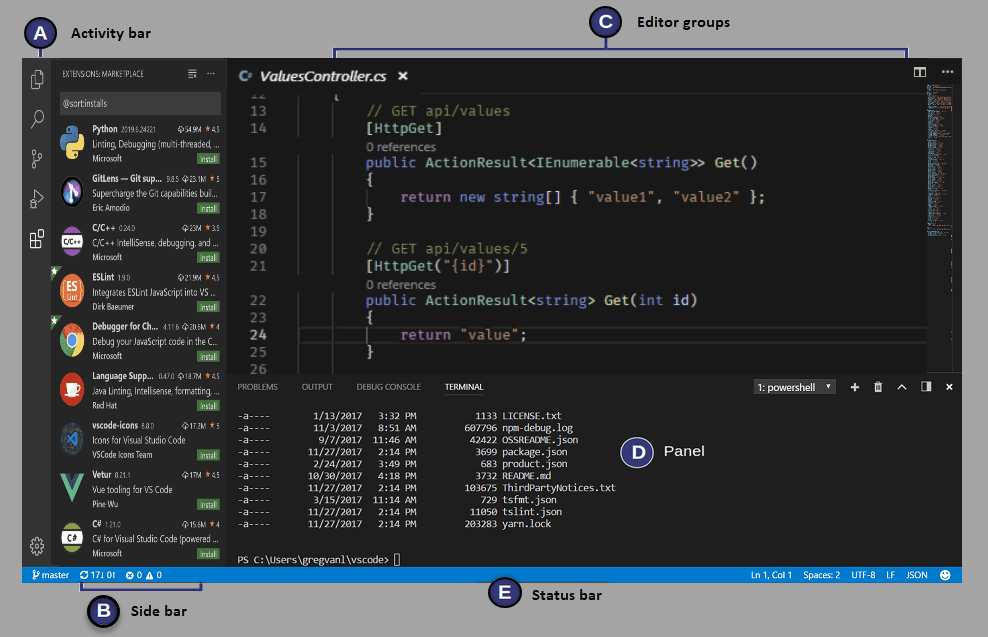

At its heart, Visual Studio Code is a code editor, with a user interface and layout that is similar to many other code editors. On the left side of the interface is an explorer panel that shows all of the files and folders that you have access to. On the right side is an editor area that displays the contents of the files you have opened.

## Visual Studio Code user interface

The following diagram shows the five areas that are included in the Visual Studio Code user interface.

**A** - The Activity bar is the narrow vertical bar located on the far left-hand side of the window. The Activity bar lets you switch between views (such as Explorer or Extensions) and gives you additional context-specific indicators, like the number of outgoing changes when Git is enabled.

**B** - The Side bar contains different views like the Explorer to assist you while working on your project.

**C** - The Editor is the area that's used to edit your files. You can open as many editors as you like side by side vertically and horizontally.

**D** - The Panels area is used to display different panels below the editor region for output or debug information, errors and warnings, or an integrated terminal. Panel can also be moved to the right for more vertical space.

**E** - The Status bar is the horizontal bar along the bottom of the window that displays information about the opened project and the files you edit.

Each time you start VS Code, it opens up in the same state it was in when you last closed it. The folder, layout, and opened files are preserved.

You will be working in all of the screen regions above. For now, however, pay special attention to the Activity bar, it is where you select the activity you want to perform, as well as the Side bar. The first thing you will be doing in the VS Code user interface is selecting and installing the C# extension for C# from the Activity and Side bars.

Extensions are application development "helpers" that provide assistance to the developer. The C# extension will help us with finding and fixing problems in our code.

## Explore the Visual Studio Code user interface

Let's open Visual Studio Code and take a quick tour of the IDE.

### Open Visual Studio Code and examine the Get Started page

1. Use the Windows Start menu to open Visual Studio Code.

    If you open the Windows Start menu, you should see Visual Studio Code listed as a recently added application. You can also scroll down to find Visual Studio Code.

    Another option is to type Visual Studio Code in the Windows Search box on the launch tray at the bottom of the screen.

1. Notice that Visual Studio Code opens with some "Get Started" information displayed in the Editor.

    The first time that you open Visual Studio Code, the Get Started page displays some helpful tutorials, like the **Get Started with VS Code** content that you see now. You can examine this information at your leisure another time, but for now we will move on to a quick tour of the user interface.

1. On the **Get Started** page, click **< Get Started**

    Notice that the tutorials are listed on the right side of the Get Started page. You can also access these tutorials from the Visual Studio Command Palette that is accessible from the View menu.

1. Notice that **Show welcome page on startup** is selected (checked).

    Leave this checked for now so that you see this information each time Visual Studio Code opens.

1. In the upper left corner, to close the Get Started page, click **Close**.

    The Close button is the "X" located to the right of **Get Started**. If you hover the mouse pointer over the X, the word **Close** will appear.

### Examine the Activity bar and Side bar

1. Notice that the **Side bar** to the right of the **Activity bar** is collapsed.

    You may recall that the **Activity bar** is the vertical list of icons on the far left of the Visual Studio Code window. The contents of the **Side bar** is dependent on what is currently selected from the **Activity bar**.

1. Position your mouse pointer over the **Activity bar**, and then hover the mouse pointer over each of the icons to display labels.

    You should see that the two Activity bar buttons at the bottom left are as follows (from top to bottom):

    - Accounts
    - Manage

    And you should see that the five Activity bar buttons at the top left are as follows (from top to bottom):

    - Explorer
    - Search
    - Source Control
    - Run and Debug
    - Extensions

    The Explorer and Extensions buttons are the ones we are interested in for now.

1. On the **Activity bar**, click **Explorer**.

    The Side bar should open and show contextual information.

1. Notice that the **Side bar** is now labeled **EXPLORER**.

1. Take a moment to examine the information displayed in the **EXPLORER** Side bar.

1. Notice that **EXPLORER** is used to access/explore project folders and code files.

    Since this is the first time that you've opened Visual Studio Code, you don't have a project folder open. As you begin working on code projects, Visual Studio Code will remember what you were working on and open your project files when it opens.

1. On the **Activity bar**, click **Extensions**.

1. Notice that the **Side bar** is now labeled **EXTENSIONS**.

1. Take a moment to examine the information displayed in the **EXTENSIONS** Side bar.

    VS Code extensions let you add languages, debuggers, and tools to your installation to support your development workflow. We will be installing a C# extension later in this module.

1. On the **Activity bar**, to close the **EXTENSIONS** Side bar, click **Extensions**.

### Examine the top menu options

1. To view the File menu options, click **File**.

1. Notice the options presented on the **File** menu.

    The File menu options are pretty much what you would expect.  

1. Take a minute to examine the **Edit** menu options, and then each of the other top level menu items.

1. Notice that several of the menus include options for interacting with your code.

    For example:

    - The Edit menu includes options to find, replace, and toggle code comments, as well as the standard cut, copy, paste, undo, and redo.
    - The Selection menu includes options for selecting and manipulating code lines.
    - The Run menu includes options to run and debug your application.

1. On the **Terminal** menu, click **New Terminal**.

1. Take a moment to examine the contents of the Terminal panel.

    You can switch between the tabs (PROBLEMS, OUTPUT, DEBUG CONSOLE, and TERMINAL) and hover the mouse pointer over the buttons (upper right) to display the button labels.

1. Notice that the Terminal panel includes command prompt.

    The Terminal panel can be used to run command line interface (CLI) commands. You will be using CLI commands later in this module.

1. In the upper-right corner of the Terminal panel, click **Close panel**.

1. On the **View** menu, click **Command Palette**

    The command palette can be used to find and run all sorts of useful commands. We don't have the time or the need to examine them in detail now, but it's good to know where to find the command palette.

1. At the command palette prompt, type **user interface** and then click **User Interface Overview**.

1. Take a minute to review the information presented on the User Interface Overview screen.

That completes our tour of the Visual Studio Code user interface for now, but once you begin coding, we will continue to point out ways that Visual Studio Code can help boost your productivity.
